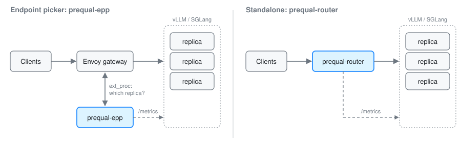

<div align="center">

# prequal

**Prefix- and load-aware request routing for LLM inference, in Rust.**

[](https://github.com/prequal-rs/prequal/actions/workflows/ci.yml)
[](#license)
[](#building-from-source)

[Quick start](#quick-start) · [Benchmarks](docs/benchmarks.md) · [Configuration](docs/configuration.md) ·
[Migrating from llm-d](docs/migrating-from-llm-d.md) · [Conformance](docs/conformance.md) · [Roadmap](docs/roadmap.md)

</div>

---

prequal routes requests across vLLM and SGLang replicas. It sends each request to the replica that already has the
prompt's prefix cached, unless that replica is busy. It ships as two binaries:

- **`prequal-epp`** is an endpoint picker for the Kubernetes [Gateway API Inference Extension][gie]. It replaces the
  picker image in [llm-d][llmd]'s chart and accepts the chart's flags, but does not implement every llm-d feature
  ([what you would lose](docs/migrating-from-llm-d.md#check-what-you-would-lose)).
- **`prequal-router`** is a standalone OpenAI-compatible proxy. It needs no gateway and no Envoy.

Neither binary needs changes to the engines. Both read the Prometheus metrics that vLLM and SGLang already export.

## Results

Compared with llm-d v0.11's endpoint picker, swapping in `prequal-epp` gives:

- **2.3× lower median time-to-first-token** at 25 QPS on shared-prefix load (44 ms vs 100 ms)
- **6× lower median time-to-first-token** when two pickers share a fleet (65 ms vs 401 ms)
- **About ½ the picker CPU and ⅓ the memory** at peak (≤ 0.85 vs ≥ 1.6 cores; ≤ 38 vs ≥ 105 MiB)
- **Higher prefix-cache hit rate** when the KV cache is under pressure (0.563 vs 0.406 with two pickers)

These were measured on llm-d's own benchmark stack in kind, with [simulated engines][sim] (no GPUs) and
[inference-perf][perf] for load. Three conditions matter when reading them:

- The two-picker figures run two active llm-d pickers. llm-d's chart turns on leader election with two replicas, so
  only one would serve.
- The two-picker hit rates are from one round per arm.
- The llm-d arm logs at `--v=4`, as llm-d's nightly values do; there is no arm with quieter logging.

Methodology, caveats and the full results are in [docs/benchmarks.md](docs/benchmarks.md).

## Quick start

**Try it locally.** This needs only Docker: no GPUs and no cluster. It starts two fleets of four simulated vLLM
replicas, puts `prequal-router` in front of one and a round-robin router in front of the other, and sends the same
shared-prefix workload through each.

```sh
docker compose -f deploy/demo/compose.yaml up --build --abort-on-container-exit --exit-code-from bench
```

```
policy       requests failed prefix hit  TTFT p50     p90     p99
prequal           600      0      89.8%      16ms    27ms   107ms
round-robin       600      0      31.7%      96ms   114ms   128ms
```

Round-robin's hit rate varies from run to run (32–44% across our runs). `RATE` and `DURATION` change the load
(defaults: 10 QPS for 60 s). The settings are in
[deploy/demo/compose.yaml](deploy/demo/compose.yaml).

**Endpoint picker in llm-d.** Point the chart's EPP image at `prequal-epp`. It accepts the chart's existing flags.

```sh
helm install router oci://ghcr.io/llm-d/charts/llm-d-router-standalone --version v0.11.0 \
  --set router.epp.image.registry=ghcr.io/prequal-rs \
  --set router.epp.image.repository=prequal-epp \
  --set router.epp.image.tag=0.1.0
```

Already running llm-d? [Migrating from llm-d's picker](docs/migrating-from-llm-d.md) covers what changes, how to
verify the switch and how to roll back.

**Standalone router.** This mode needs no gateway: one binary sits in front of your replicas.

```sh
# Prebuilt binary from GitHub Releases (also aarch64-unknown-linux-musl and aarch64-apple-darwin).
# Replicas are given by address or DNS name; a name with several addresses adds each one.
curl -L https://github.com/prequal-rs/prequal/releases/download/v0.1.0/prequal-0.1.0-x86_64-unknown-linux-musl.tar.gz | tar xz
prequal-0.1.0-x86_64-unknown-linux-musl/prequal-router --listen 0.0.0.0:8000 --engine vllm vllm-0:8000 vllm-1:8000

# From source
cargo run --release -p prequal-router -- --listen 0.0.0.0:8000 --engine vllm vllm-0:8000 vllm-1:8000

# Kubernetes, discovering ready pods behind a Service
helm install router oci://ghcr.io/prequal-rs/charts/prequal-router --version 0.1.0 \
  --set target.service=vllm --set target.engine=vllm
```

Clients call the usual OpenAI endpoints (`/v1/completions`, `/v1/chat/completions`), and streamed responses pass
through unchanged. Flags, metrics, error codes and supported engine versions are in
[docs/configuration.md](docs/configuration.md).

## How it works

Every request is scored against every ready replica, and it goes to the replica with the best score:

- **Prefix affinity.** prequal keeps an approximate index of each replica's cached prefixes, learned from its own
  placements.
- **Right-sized cache model.** Each replica's index is sized from the KV capacity the engine reports, so it doesn't
  forget prefixes the engine still holds.
- **Fresh load.** Each replica's scraped queue depth is combined with the requests in flight there that haven't
  received a first token yet. This avoids herding between scrapes.
- **KV headroom.** Replicas close to KV-cache eviction lose affinity, because the evictions would cost more cache hits
  than staying would save.
- **Hot-prefix spreading.** A prompt with more than its fair share of traffic spreads across replicas by load.
- **Overload shedding.** A replica running well above the fleet's average load is penalised until it recovers.
- **Coordinated cold placement.** When several routers share one fleet, rendezvous hashing makes them agree on where a
  new prefix goes.

The scoring weights follow llm-d's defaults (prefix ×3, queue ×2, free KV ×2), so the behaviour is familiar. The
rationale for each term, and the alternatives that lost in measurement, are documented on
[`Prequal`](crates/prequal-llm/src/policy/prequal.rs).

## Deployment modes

<p align="center">
  
</p>

| Mode | Data plane | Picker CPU per request | Use when |
|---|---|---|---|
| `prequal-epp` | Envoy streams every token through the picker | ~20 ms | You already run an Inference Extension gateway |
| `prequal-epp`, [lean mode](docs/lean-mode.md) | Envoy with `response_body_mode: NONE` | ~2 ms | You want the same setup at a tenth of the picker CPU |
| `prequal-router` | None: the router is the proxy | ~17 ms total | You don't need a gateway and want the lowest total CPU |

In lean mode, picker and Envoy together use half the CPU of default mode. Precision drops slightly on bursty traffic and
on hot-prefix traffic. llm-d's own picker relies on response bodies, so it can't run this way at the same cost
([details](docs/lean-mode.md)); we have not tested it in this mode. The CPU figures are from the
[data-plane harness](docs/benchmarks.md#3-data-plane-cost-harness), which stores no raw data.

## Compatibility

| Component | Status |
|---|---|
| vLLM, SGLang | Read through their Prometheus metrics. Benchmarked on llm-d-inference-sim v0.10.2. Neither binary has run against a real engine yet; SGLang is untested |
| llm-d `llm-d-router-standalone` chart v0.10, v0.11 | Works. The chart's flags are accepted as they are |
| agentgateway v1.5.0 | Works. Passes the Inference Extension conformance suite v1.6.2 (Gateway profile, 14/14) |
| Istio 1.31.1 | Does not work ([details](docs/conformance.md#istio)) |
| kgateway, Envoy Gateway, GKE Gateway | Untested. [Reports](https://github.com/prequal-rs/prequal/issues/new/choose) are welcome |
| Gateway API Inference Extension | `InferencePool` v1 |
| Kubernetes | 1.32 or later |

Exact versions are in [docs/configuration.md](docs/configuration.md#supported-versions).

## When not to use prequal

- **You run Istio.** Its ext_proc requests carry an `:authority` that Rust's HTTP/2 stack rejects. Use agentgateway or
  llm-d's Envoy instead. Details are in [conformance](docs/conformance.md).
- **You need Envoy features with the standalone router.** `prequal-router` has no retries and no TLS termination.
- **You need engine-assisted caching.** KV events, offloaded KV tiers and prefill/decode disaggregation are on the
  [roadmap](docs/roadmap.md), not yet built.
- **You need results from real GPUs.** The routing results all come from simulated engines. The one run on a real
  GPU ([results](results/README.md#vllm-queue-order-4070)) tests an experimental engine queue order with the
  benchmark harness, not the router.

## Crates

| Crate | Description |
|---|---|
| [`prequal-epp`](crates/prequal-epp) | Gateway API Inference Extension endpoint picker (Envoy `ext_proc`, `InferencePool` v1) |
| [`prequal-router`](crates/prequal-router) | Standalone OpenAI-compatible router with static or `EndpointSlice` discovery |
| [`prequal-llm`](crates/prequal-llm) | Routing library shared by both binaries: scheduler, policies, engine-metrics scraping |
| [`prequal-core`](crates/prequal-core) | Runtime-agnostic Prequal: probe pool, hot-cold selection, outlier ejection |
| [`prequal-server`](crates/prequal-server) | Server side of Prequal: in-flight tracking, latency estimators, a tower layer |
| [`prequal-tower`](crates/prequal-tower) | Prequal as a tower load balancer over any `Discover` |
| [`prequal-pingora`](crates/prequal-pingora) | Prequal as a Pingora `BackendSelection`, with an optional reverse proxy |
| [`prequal-testbed`](crates/prequal-testbed) | Benchmarks and the virtual-time fleet simulator (not published) |

### General-purpose load balancing

The name comes from [Prequal][paper] (Wydrowski et al., NSDI '24), the load balancer behind YouTube. Its core idea is
to route on fresh load signals rather than stale averages. `prequal-core`, `-server`, `-tower` and `-pingora`
implement the paper for ordinary request/response services. Their load headers are compatible with envoy-prequal.

On a 20-server HTTP testbed at 0.9 load, these crates cut p99 latency by 28–37% against tower's `p2c` + `PeakEwma`.
In a second test, 2 of the 20 servers failed instantly while reporting no load. The crates avoided about 85% of the
failed requests.

This is an independent project. It is not affiliated with or endorsed by Google, llm-d, vLLM, SGLang or the Gateway
API Inference Extension project.

## Benchmarks

The benchmarks run at three levels. The first is fastest and the last is closest to production:

1. **Virtual-time simulator** (`llm-bench --virtual`). It runs the real scheduler against modelled engines and
   public production traces. Every policy over many seeds takes about a minute.
2. **HTTP testbed** (`llm-bench`). Real sockets, simulated vLLM engines, and reimplemented baselines (llm-d, SGLang
   cache-aware, Dynamo).
3. **llm-d's stack in kind** (`tools/kind-llmd.sh`, `tools/kind-cache.sh`). llm-d's own chart, simulator and load
   generator, with only the picker swapped.

Reproduction commands and full results are in [docs/benchmarks.md](docs/benchmarks.md). The raw data is in
[results/](results/README.md).

## Status

prequal is pre-release (0.1).

- `prequal-epp` passes the Gateway API Inference Extension v1.6.2 conformance suite (Gateway profile, 14/14). It was
  tested behind agentgateway v1.5.0. The suite has no EPP profile yet, so this is not a certification. See
  [docs/conformance.md](docs/conformance.md).
- Neither binary has been benchmarked on real GPUs yet.

## Building from source

```sh
cargo build --release -p prequal-epp -p prequal-router
tools/with-cmake.sh cargo test --workspace --all-features   # the Pingora crates need cmake
```

The libraries need Rust 1.85 or later. `prequal-epp`, `prequal-router` and the `kubernetes` feature of
`prequal-pingora` need Rust 1.89 or later.

## Contributing

See [CONTRIBUTING.md](CONTRIBUTING.md). Report security issues as described in [SECURITY.md](SECURITY.md).

## License

Licensed under either of [Apache License 2.0](LICENSE-APACHE) or [MIT](LICENSE-MIT) at your option. Unless you state
otherwise, any contribution you intentionally submit for inclusion is dual-licensed as above, without additional terms.

[gie]: https://github.com/kubernetes-sigs/gateway-api-inference-extension
[llmd]: https://github.com/llm-d/llm-d
[sim]: https://github.com/llm-d/llm-d-inference-sim
[perf]: https://github.com/kubernetes-sigs/inference-perf
[paper]: https://www.usenix.org/conference/nsdi24/presentation/wydrowski
